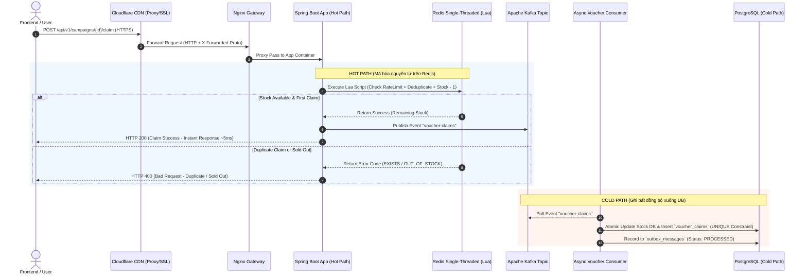
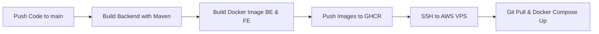

# PromoGuard – Hệ thống Flash Sale Voucher Chịu Tải Cao (High-Throughput Voucher Distribution System)

[](https://github.com/quangthangk4/promoguard/actions/workflows/deploy.yml)
[](https://thanghcmut-promoguard.site)

---

## 📌 Giới thiệu & Mục tiêu Dự án

**PromoGuard** là một hệ thống backend phân phối Voucher / Promo Code chịu tải cao được thiết kế nhằm giải quyết triệt để các bài toán kinh điển trong các nền tảng Thương mại điện tử (Shopee, Lazada, Tiki, Amazon) khi tổ chức **Flash Sale**:

*   ❌ **Oversell (Bán vượt số lượng):** 100 voucher nhưng 105 người claim thành công.
*   ❌ **Duplicate Claim (Claim trùng lặp):** 1 user dùng công cụ/script bấm claim hàng loạt để nhận 2+ voucher.
*   ❌ **Database Bottleneck / Connection Pool Exhaustion:** Hàng chục ngàn luồng truy cập đồng thời vào DB làm treo hệ thống.
*   ❌ **Single Point of Failure / Event Loss:** Mất dữ liệu khi hệ thống gặp sự cố mạng hoặc sập đột ngột.

---

## 🎯 Bài toán Giả lập & Chỉ số Kiểm thử

*   **Quy mô Flash Sale:** **100 Voucher** khả dụng mở bán trong **1 giây**.
*   **Tải trọng:** **10.000 Concurrent Users** truy cập và bấm nút Claim đồng thời.
*   **Kết quả kỳ vọng (Strict Invariants):**
    *   ✅ **Claim Thành công:** Đúng **100** requests.
    *   ❌ **Hết hàng (Sold Out):** Đúng **9.900** requests bị từ chối với thông báo thích hợp.
    *   🔒 **Oversell Count:** **0**
    *   🔒 **Duplicate Claims:** **0**

---

## 🧠 LUỒNG LOGIC XỬ LÝ CỐT LÕI (Dành cho Phỏng vấn Technical)

> Đây là phần quan trọng nhất thường được trao đổi sâu trong các buổi phỏng vấn về **System Design**, **Concurrency**, và **High Availability**.

### Architecture Overview Diagram



---

### 💡 Chi Tiết 5 Bước Logic Kỹ Thuật (Key Interview Takeaways)

#### 1. Loại bỏ Database khỏi Hot Path (Stock Deduction via Redis Lua Script)
*   **Vấn đề:** Nếu trừ stock bằng SQL `UPDATE campaigns SET stock = stock - 1 WHERE id = ?`, DB sẽ bị **Row Lock Contention** và **Connection Pool Exhaustion** khi 10.000 requests cùng tranh chấp 1 dòng dữ liệu.
*   **Giải pháp:** Đưa toàn bộ kiểm tra và trừ stock lên **Redis Single-Threaded** chạy qua **Lua Script**. Vì Lua Script chạy nguyên tử (atomic), không có 2 request nào có thể can thiệp giữa chừng.

#### 2. Bảo vệ 2 Lớp Chống Claim Trùng Lặp (Dual-Layer Idempotency)
*   **Lớp 1 (Fast-Path / In-Memory):** Kiểm tra `SISMEMBER campaign:{id}:claimed_users {userId}` ngay trong Lua Script trên Redis. Nếu user đã claim, từ chối ngay lập tức (~1ms).
*   **Lớp 2 (Persistence / DB Level):** Đặt ràng buộc `UNIQUE INDEX (campaign_id, user_id)` trong bảng `voucher_claims` ở PostgreSQL để chặn tuyệt đối nếu có sự cố lặp message từ Kafka.

#### 3. Chống Spam / Brute Force (Sliding Window Rate Limiting)
*   Sử dụng **Redis Sorted Set (ZSet)** kết hợp với Lua Script tính toán cửa sổ trượt.
*   Giới hạn 5 requests / 10s per user. Nếu vượt quá, Nginx / Spring Boot sẽ trả về ngay `HTTP 429 Too Many Requests` kèm headers chuẩn RFC (`X-RateLimit-Limit`, `X-RateLimit-Remaining`, `Retry-After`).

#### 4. Eventual Consistency & Async Kafka Ingestion
*   Sau khi Lua Script trừ stock thành công trên Redis, ứng dụng trả về HTTP 200 thành công ngay cho User mà **không đợi ghi DB**.
*   Bản ghi sự kiện được đẩy vào Kafka topic `voucher-claims`. **Voucher Claim Consumer** lắng nghe topic này và ghi xuống DB theo từng lô (Batch processing), biến lưu lượng truy cập dạng **Spike** (đột biến) thành dòng chảy ổn định (Smooth Write Traffic) vào PostgreSQL.

#### 5. Cơ chế Tự Phục Hồi & Hoàn Tác (Rollback & Compensation Logic)
*   Nếu đẩy tin nhắn lên Kafka thất bại, hệ thống thực hiện Lua Script hoàn tác: `INCR` lại stock trên Redis và `SREM` xoá user khỏi tập hợp đã claim để giữ đúng nhất quán dữ liệu giữa Redis và DB.

---

## 🧪 TỰ ĐỘNG HÓA KIỂM THỬ (TESTING STRATEGY)

Dự án áp dụng mô hình kiểm thử toàn diện từ Unit Test, Integration Test đến Load Test (Giả lập tải lớn):

### 1. Integration Tests với Testcontainers (`CampaignControllerIntegrationTest`)
*   Sử dụng **Testcontainers** để khởi tạo các container thật của **PostgreSQL** và **Redis** ngay trong quá trình chạy `mvn test`.
*   Giúp kiểm thử chính xác các câu lệnh SQL jOOQ, ràng buộc DB và các hàm Lua Script trên Redis mà không phụ thuộc vào môi trường bên ngoài.

### 2. Load Testing với Gatling (`VoucherClaimSimulation`)
Hệ thống sử dụng **Gatling (Java DSL)** để thực hiện các kịch bản kiểm thử hiệu năng chịu tải:

*   **Script kịch bản:** [VoucherClaimSimulation.java](file:///c:/Users/thang/OneDrive/Desktop/PromoGuard/PromoGuard-BE/src/test/java/com/promoguard/demo/simulation/VoucherClaimSimulation.java)
*   **Cấu hình giả lập:**
    *   Đọc danh sách Bearer Token thật của 1.000 -> 10.000 users từ `tokens.csv`.
    *   Simulate kịch bản 10% user click ngay lập tức ở giây đầu tiên, 90% user ramp up trong 10 giây tiếp theo.

#### 🚀 Cách chạy Gatling Load Test:
```powershell
cd PromoGuard-BE
# Chạy load test với 1000 users ảo đồng thời
.\mvnw.cmd test -Dtest=VoucherClaimSimulation -Dusers=1000 -Dramp=5
```

---

## 🚀 QUY TRÌNH CI/CD PIPELINE (AUTOMATED DEPLOYMENT)

Dự án thiết lập luồng **CI/CD Tự động hóa 100%** qua **GitHub Actions** (`.github/workflows/deploy.yml`):



### Chi tiết các bước Pipeline:

1.  **Continuous Integration (CI):**
    *   Khi có commit mới trên branch `main`, GitHub Actions khởi tạo dịch vụ PostgreSQL runner.
    *   Biên dịch source code Java 21 bằng Maven `./mvnw clean package -DskipTests`.
    *   Build Docker Image cho Frontend (Vite/React) và Backend (Spring Boot).
    *   Đăng nhập và đẩy (Push) Docker Images lên **GitHub Container Registry (GHCR)**:
        *   `ghcr.io/quangthangk4/promoguard-be:latest`
        *   `ghcr.io/quangthangk4/promoguard-fe:latest`

2.  **Continuous Deployment (CD):**
    *   Sử dụng `appleboy/ssh-action` kết nối bảo mật qua **SSH Key** tới **AWS VPS (Ubuntu)**.
    *   Tự động `git pull origin main` để cập nhật các file cấu hình mới nhất (`docker-compose.yml`, `nginx.conf`).
    *   Đăng nhập GHCR trên VPS và thực hiện `docker compose --profile full pull` & `up -d`.
    *   Chạy `docker image prune -f` để tự động dọn dẹp các Docker image cũ nhằm tiết kiệm dung lượng VPS.

---

## 🌐 HẠ TẦNG & TÊN MIỀN (PRODUCTION DEPLOYMENT)

*   **Tên miền chính thức:** [https://thanghcmut-promoguard.site](https://thanghcmut-promoguard.site)
*   **Quản lý DNS & SSL/TLS:** **Cloudflare CDN** (Proxied mode 🟧 - Ẩn IP VPS thật, chống DDoS, hỗ trợ HTTPS tự động).
*   **Reverse Proxy / Gateway:** **Nginx** (Điều hướng traffic frontend `/`, backend `/api/`, Swagger `/swagger-ui/` và Keycloak `/auth/`).
*   **Authentication Portal (Keycloak):** `https://thanghcmut-promoguard.site/auth` (Giao thức OAuth2 / OpenID Connect + PKCE).

---

## 🛠️ Hướng dẫn Khởi chạy Local

### 1. Khởi động hạ tầng Docker nền tảng
```powershell
docker compose up -d
```
*   **PostgreSQL**: `localhost:5432`
*   **Redis**: `localhost:6379`
*   **Kafka**: `localhost:9094` (Kafka UI tại `localhost:8081`)
*   **Keycloak**: `localhost:8082` (Admin Portal)
*   **Prometheus**: `localhost:9090` | **Grafana**: `localhost:3000` (`admin`/`admin`)

### 2. Chạy ứng dụng Spring Boot
```powershell
cd PromoGuard-BE
.\mvnw.cmd spring-boot:run
```
Swagger UI: [http://localhost:8080/swagger-ui/index.html](http://localhost:8080/swagger-ui/index.html)

